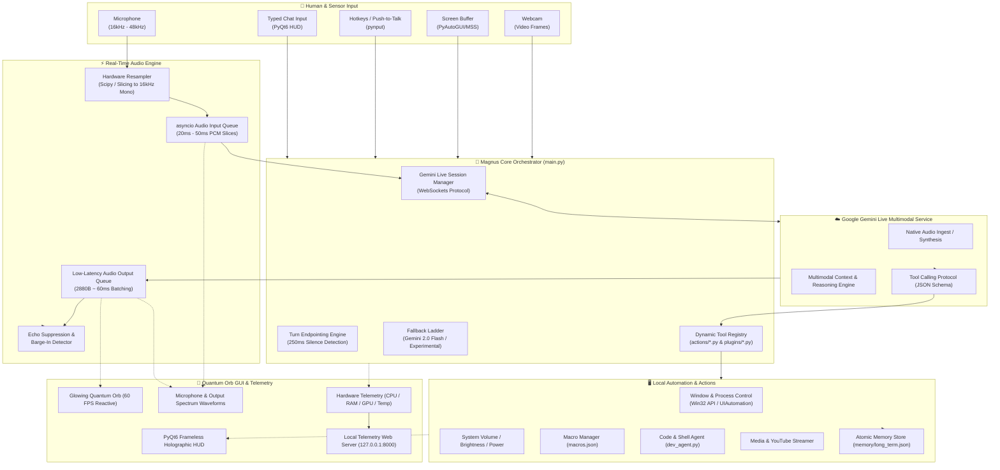

# 🌌 MAGNUS AI
### Enterprise-Grade Real-Time Multimodal Voice Assistant & Autonomous System Agent

Developed and Maintained by **[Riddhi Das](https://github.com/RIDDHIDEV-OPS)**

[](LICENSE)
[](https://www.python.org/)
[](https://www.microsoft.com/windows)
[](https://ai.google.dev/)
[](https://www.riverbankcomputing.com/software/pyqt/)

---

## 📑 Table of Contents

- [🌌 Overview](#-overview)
- [🏗️ Architectural Blueprint](#️-architectural-blueprint)
- [🔄 Detailed Execution Workflows](#-detailed-execution-workflows)
  - [1. Real-Time Audio Streaming Pipeline](#1-real-time-audio-streaming-pipeline)
  - [2. Autonomous Tool Execution & OS Control](#2-autonomous-tool-execution--os-control)
  - [3. Multimodal Vision Pipeline](#3-multimodal-vision-pipeline)
  - [4. Macro Routines Lifecycle](#4-macro-routines-lifecycle)
- [✨ Core Capabilities & Innovations](#-core-capabilities--innovations)
- [🗂️ Project Anatomy](#️-project-anatomy)
- [🛠️ Action Modules & Tool Reference](#️-action-modules--tool-reference)
- [🚀 Quick Start & Installation](#-quick-start--installation)
  - [Prerequisites](#prerequisites)
  - [Automated Setup](#automated-setup)
  - [Manual Installation](#manual-installation)
  - [Configuration](#configuration)
  - [1-Click Launchers & Desktop Shortcut](#1-click-launchers--desktop-shortcut)
- [⚙️ Configuration Reference](#️-configuration-reference)
- [🗣️ Voice Commands & Macro Cheat Sheet](#️-voice-commands--macro-cheat-sheet)
- [🔒 Security & Local-First Privacy](#-security--local-first-privacy)
- [🩺 Diagnostics & Troubleshooting](#-diagnostics--troubleshooting)
- [👤 Author & Contributions](#-author--contributions)

---

## 🌌 Overview

**Magnus AI** is a state-of-the-art desktop AI assistant and autonomous agent designed for seamless voice-first interaction and deep Windows operating system control. Powered by the **Google Gemini Live WebSockets API**, Magnus AI offers full-duplex, bidirectional audio streaming with near-zero latency, dynamic visual perception, persistent memory recall, and deep Win32 integration.

Unlike traditional voice assistants that rely on slow speech-to-text (STT) ➔ text-LLM ➔ text-to-speech (TTS) sequential pipelines, Magnus AI communicates directly using native real-time audio streams. It can see through your screen or webcam, listen with millisecond turn detection, speak with lifelike natural intonation, launch and control applications with zero latency, and execute complex multi-step productivity macros—all with **zero subscriptions** and **local-first privacy**.

---

## 🏗️ Architectural Blueprint

Magnus AI connects local hardware interfaces directly to the Gemini Live Multimodal foundation model via high-speed asynchronous pipelines:



---

## 🔄 Detailed Execution Workflows

### 1. Real-Time Audio Streaming Pipeline
```
[User Speaks] ➔ [PyAudio/sounddevice Stream]
       │
       ▼ (Hardware rate: e.g. 48,000 Hz Stereo)
[Real-Time Resampling Engine]
       │ (Downsamples & averages to 16,000 Hz Mono 16-bit PCM)
       ▼
[Audio In Queue] ➔ [Gemini Live WebSocket Client]
       │
       ▼ (Continuous audio streaming with VAD endpointing)
[Gemini Live Server Endpoint]
       │
       ├─► [User Pauses for 250ms] ➔ Model Turn Triggers Instantly
       │
       ▼ (Gemini returns 24,000 Hz PCM audio chunks)
[Low-Latency Output Buffer (~60ms / 2880 bytes)]
       │
       ├─► [Quantum Orb Visualizer & FFT Waveform Animation]
       │
       ▼
[Speaker Output & Tail Guard Activated]
```
* **Hardware Adaptation**: Automatically detects audio input sample rates (16kHz, 44.1kHz, 48kHz) and downsamples via real-time vector slicing or `scipy.signal.resample` to 16kHz mono.
* **Low-Latency Playback**: Batches audio chunks in ultra-small ~60ms slices (2,880 bytes at 24kHz) for instantaneous vocal feedback with minimum speaker jitter.
* **Barge-in / Interruption**: If the user begins speaking while Magnus AI is talking, audio output is immediately flushed and current synthesis terminates within ~100ms.

---

### 2. Autonomous Tool Execution & OS Control
```
[User: "Open Visual Studio Code and check system volume"]
       │
       ▼
[Gemini Emits Function Calls via WebSocket]
       ├─► open_app(app_name="visual studio code")
       └─► get_volume()
       │
       ▼
[Dynamic Tool Dispatcher (core/action_loader.py)]
       │
       ├─► [actions/open_app.py]
       │      │─ Check running processes (psutil)
       │      │─ Detect window handle (HWND via win32gui)
       │      │─ Bring to front immediately using SetForegroundWindow
       │      └─ If not running, launch via Shell/AppsFolder with non-blocking wait
       │
       ├─► [actions/computer_settings.py]
       │      └─ Query PyCAW / Windows Audio Endpoint Volume API
       │
       ▼
[Tool Outputs Returned to Gemini Session]
       │
       ▼
[Magnus AI responds: "I've brought VS Code to the front. Your volume is at 60%."]
```

---

### 3. Multimodal Vision Pipeline
```
[User: "Look at my screen and help me fix this syntax error"]
       │
       ▼
[actions/screen_processor.py]
       │
       ├─► High-speed screenshot buffer (MSS / PyAutoGUI)
       ├─► JPEG compressed with optimal downscaling (<1.5MB)
       │
       ▼
[Sent as Real-Time Image Part to Gemini Live Session]
       │
       ▼
[Gemini Multimodal Reasoning inspects active editor & error trace]
       │
       ▼
[Magnus AI speaks the solution aloud and presents code via HUD]
```

---

### 4. Macro Routines Lifecycle
```
[User: "Activate Work Mode"]
       │
       ▼
[actions/macro_manager.py loads config/macros.json]
       │
       ├─► Step 1: Set master volume to 25%
       ├─► Step 2: Launch "Google Chrome" to project dashboard
       ├─► Step 3: Launch "Visual Studio Code" & bring to foreground
       ├─► Step 4: Launch "Spotify" or play focus music on YouTube
       └─► Step 5: Save execution timestamp to memory/long_term.json
       │
       ▼
[Magnus AI confirms: "Work mode initiated. Workspace is ready, Riddhi."]
```

---

## ✨ Core Capabilities & Innovations

| Feature | Description |
| :--- | :--- |
| **Bidirectional Full-Duplex Voice** | Real-time audio streaming directly via WebSockets. No waiting for speech-to-text transcription. |
| **Instant Endpointing (~250ms)** | Ultra-fast conversational responsiveness with configurable silence duration and turn sensitivity. |
| **Quantum Orb & Holographic HUD** | Dynamic PyQt6 interface featuring a glowing 60fps pulsating quantum sphere and live audio waveforms. |
| **Foreground Window Enforcer** | Win32 API logic that forces newly opened or existing windows to the front, eliminating hidden background launches. |
| **Multi-Step Macro Engine** | Declarative workflows defined in `config/macros.json` (Work, Study, Night, Chill, Reset modes). |
| **Multimodal Vision** | Captures desktop screens, active windows, or webcam streams for real-time visual assistance. |
| **Persistent Local Memory** | Stores preferences, user facts, and history in `memory/long_term.json` with thread-safe atomic writes. |
| **Hardware Telemetry** | Real-time CPU, RAM, GPU, and thermal telemetry rendered on the HUD and the local web dashboard. |
| **Model Fallback Ladder** | Automatic failover across Gemini 2.0 Flash, Gemini Experimental, and Gemini 1.5 Pro to prevent downtime. |
| **Native Media Playback** | Directly queries and streams YouTube videos and music with automatic volume un-muting. |

---

## 🗂️ Project Anatomy

```
Magnus-AI/
├── main.py                     # Primary orchestrator: Gemini Live session, audio I/O, event loops
├── ui.py                       # PyQt6 HUD: Quantum Orb, audio visualizers, telemetry, settings drawer
├── run_magnus.bat              # 1-Click Windows batch launcher
├── setup.py                    # Automated dependency resolver and environment bootstrapper
├── setup_shortcut.py           # Automated Desktop Shortcut generator (.lnk) with custom icon
├── requirements.txt            # Python package dependencies
├── LICENSE                     # MIT License
├── readme.md                   # System documentation and manuals
│
├── actions/                    # Self-describing system actions and autonomous tools
│   ├── active_window.py        # Active foreground window context inspector
│   ├── browser_control.py      # Browser tab manipulation and URL navigation
│   ├── clipboard_helper.py     # System clipboard reading, copying, and clearing
│   ├── computer_control.py     # Mouse, keyboard, and low-level desktop automation
│   ├── computer_settings.py    # Volume, brightness, Wi-Fi, and power state controls
│   ├── dev_agent.py            # Autonomous code generation, execution, and debugging
│   ├── file_controller.py      # File system operations (create, move, delete, rename)
│   ├── file_processor.py       # Document reading, analysis, and text summarization
│   ├── macro_manager.py        # Multi-step productivity routines (Work, Study, Night modes)
│   ├── open_app.py             # App launcher with Win32 foreground enforcement & process reuse
│   ├── reminder.py             # Background threaded reminders and notifications
│   ├── screen_processor.py     # Desktop screen and webcam capture
│   ├── send_message.py         # Direct messaging dispatch
│   ├── weather_report.py       # Weather reports with automatic IP geocoding and caching
│   ├── web_search.py           # Grounded Google search integration
│   └── youtube_video.py        # Music and video playback with auto-unmute
│
├── core/                       # Internal engine logic
│   ├── action_loader.py        # Dynamic tool discovery and schema registration engine
│   ├── audio_devices.py        # Audio input/output device detection and device index resolution
│   ├── avatar.py               # Quantum Orb visual rendering and mouth movement driver
│   ├── gemini.py               # Gemini client, session manager, and error-handling ladder
│   ├── hotkey.py               # Global hotkey listeners for Push-To-Talk and quick toggles
│   ├── prompt.txt              # System instructions, personality protocols, and execution rules
│   └── tts.py                  # Dual Edge-TTS & pyttsx3 speech engines with multilingual fallback
│
├── memory/                     # Local persistence layer
│   ├── config_manager.py       # Settings and API key loader with runtime validation
│   ├── memory_manager.py       # Atomic, thread-safe long-term memory store
│   └── long_term.json          # User preferences and learned context (local-only, git-ignored)
│
├── dashboard/                  # Optional web telemetry interface
│   ├── server.py               # FastAPI/Starlette WebSocket telemetry server (Port 8000)
│   └── static/
│       └── app.html            # Web dashboard interface with live CPU/RAM/GPU monitors
│
└── config/                     # Configuration and credentials
    ├── api_keys.json           # Active credentials and settings (git-ignored)
    ├── api_keys.example.json   # Template configuration file
    ├── macros.json             # Declarative multi-step routine configurations
    └── jarvis.ico              # High-resolution application icon
```

---

## 🛠️ Action Modules & Tool Reference

Every tool in `actions/` is self-describing, exposing a type-annotated entry function and docstrings that are converted dynamically into Gemini function declarations at boot:

| Action File | Exposed Functions | Description |
| :--- | :--- | :--- |
| `actions/open_app.py` | `open_app(app_name)` | Launches applications or brings existing windows to front using Win32 API. Supports UWP apps, shell aliases, and domain URLs. |
| `actions/active_window.py` | `get_active_window_context()` | Returns the active window's title, process name, and process ID. |
| `actions/macro_manager.py` | `execute_macro(macro_name)` | Executes declarative routines (e.g., `work_mode`, `study_mode`, `night_mode`, `reset_mode`). |
| `actions/computer_settings.py`| `set_volume`, `get_volume`, `set_brightness`, `control_wifi`, `system_power` | Controls audio levels, display brightness, networking, and power states. |
| `actions/computer_control.py` | `press_key`, `type_text`, `click_mouse`, `scroll` | Low-level desktop interaction via PyAutoGUI. |
| `actions/clipboard_helper.py` | `read_clipboard`, `write_clipboard`, `clear_clipboard` | Hands-free system clipboard reading, copying, and clearing. |
| `actions/youtube_video.py`   | `play_youtube_video(query)` | Searches and launches YouTube media in browser, automatically unmuting playback. |
| `actions/weather_report.py`  | `get_weather(city, units)` | Real-time weather reporting with IP auto-location and Open-Meteo caching. |
| `actions/web_search.py`      | `search_web(query)` | Grounded Google search results with snippets and source links. |
| `actions/screen_processor.py`| `capture_screen`, `capture_webcam` | Captures visual frames for multimodal reasoning. |
| `actions/dev_agent.py`       | `run_code`, `create_file`, `analyze_code` | Autonomous code execution, file generation, and syntax analysis. |
| `actions/file_controller.py` | `list_files`, `move_file`, `delete_file`, `rename_file` | Local file system management. |
| `actions/file_processor.py`  | `read_file_content`, `summarize_document` | Document reading and summarization for text, code, and PDFs. |
| `actions/reminder.py`        | `set_reminder(message, delay_minutes)` | Background scheduled alerts with system notifications. |

---

## 🚀 Quick Start & Installation

### Prerequisites
- **Operating System:** Windows 10 or Windows 11 (64-bit)
- **Python:** Version 3.11, 3.12, or 3.13 (Must be added to system `PATH`)
- **Audio:** Functional microphone and speakers/headphones
- **API Key:** Google Gemini API Key (Obtain from [Google AI Studio](https://aistudio.google.com/app/apikey))

---

### Automated Setup
1. Clone the repository:
   ```bash
   git clone https://github.com/RIDDHIDEV-OPS/Magnus-AI.git
   cd Magnus-AI
   ```
2. Run the automated installer:
   ```bash
   python setup.py
   ```
   *The script automatically verifies your Python version, installs C++ wheels for PyAudio if needed, installs dependencies, and creates default configuration files.*

---

### Manual Installation
If you prefer installing dependencies manually:
```bash
python -m pip install --upgrade pip
pip install -r requirements.txt
```

---

### Configuration
1. Copy the example config:
   ```bash
   copy config\api_keys.example.json config\api_keys.json
   ```
2. Open `config/api_keys.json` in any text editor and enter your Gemini API key:
   ```json
   {
       "gemini_api_key": "AIzaSyYourActualKeyGoesHere...",
       "assistant_name": "MAGNUS AI",
       "user_name": "Riddhi Das",
       "wake_word_enabled": false,
       "push_to_talk_enabled": false,
       "hud_style": "orb"
   }
   ```

---

### 1-Click Launchers & Desktop Shortcut

#### Option A: Create a Desktop Shortcut (Recommended)
Run the automated shortcut generator:
```bash
python setup_shortcut.py
```
*A **Magnus AI** shortcut with the custom application icon will be created directly on your Windows Desktop.*

#### Option B: 1-Click Batch Script
Double-click `run_magnus.bat` in the project root directory.

#### Option C: Command Line
```bash
python main.py
```

---

## ⚙️ Configuration Reference

All settings in `config/api_keys.json` are dynamically loaded and hot-reloaded:

| Setting Key | Type | Default | Description |
| :--- | :--- | :--- | :--- |
| `gemini_api_key` | `string` | `""` | Your Google Gemini API Key from Google AI Studio. |
| `assistant_name` | `string` | `"MAGNUS AI"` | Spoken name the assistant responds to. |
| `user_name` | `string` | `"Riddhi Das"` | Your name; used for personalized greetings and context. |
| `wake_word_enabled` | `boolean` | `false` | When true, Magnus AI starts in sleep mode until wake word is spoken. |
| `push_to_talk_enabled` | `boolean` | `false` | When true, microphone stream only activates while holding the hotkey. |
| `hud_style` | `string` | `"orb"` | Visual mode for the HUD (`"orb"` or `"compact"`). |
| `input_device` | `string` | `""` | Specific input microphone device name (empty = default). |
| `output_device` | `string` | `""` | Specific output speaker device name (empty = default). |
| `turn_tuning.silence_ms` | `integer` | `250` | Milliseconds of silence before the model finishes your turn. |
| `turn_tuning.prefix_ms` | `integer` | `50` | Audio prefix buffer in milliseconds. |
| `turn_tuning.end_sensitivity`| `string` | `"high"` | Sensitivity for detecting end-of-speech (`"high"`, `"medium"`, `"low"`). |
| `turn_tuning.start_sensitivity`| `string`| `"high"` | Sensitivity for detecting speech start (`"high"`, `"medium"`, `"low"`). |

---

## 🗣️ Voice Commands & Macro Cheat Sheet

Magnus AI supports natural, conversational voice input. You do not need to memorize rigid commands. Here are common examples:

### 🚀 Productivity & Macros
- *"Activate Work Mode"* ➔ Launches Chrome, VS Code, sets volume, and configures productivity environment.
- *"Start Study Mode"* ➔ Mutes distractions, brings up notes, and plays ambient study sound.
- *"Night Mode"* ➔ Reduces screen brightness to 20%, lowers audio volume, and prepares system for evening.
- *"Reset Mode"* ➔ Restores normal volume, brightness, and standard desktop layout.

### 🖥️ Application & Window Control
- *"Open Visual Studio Code"* ➔ Instantly brings existing VS Code window to the front or launches it.
- *"Switch to Chrome"* ➔ Focuses Google Chrome immediately.
- *"Open Notepad and File Explorer"* ➔ Multi-window launch and arrangement.
- *"What window am I currently using?"* ➔ Inspects active foreground application and document.

### 🔊 System & Hardware Settings
- *"Set volume to 40%"* or *"Mute audio"*
- *"Increase brightness to 80%"*
- *"Check battery and CPU temperature"*
- *"Read my clipboard"* or *"Copy this to my clipboard"*

### 🌐 Web & Media
- *"Play lofi beats on YouTube"* ➔ Opens YouTube and begins playback.
- *"What's the weather in Tokyo?"* ➔ Detailed temperature, precipitation, and conditions.
- *"Search Google for the latest Python 3.13 release notes"* ➔ Grounded search summary.

### 👁️ Screen & Vision
- *"Look at my screen and tell me what's wrong with this code"*
- *"Describe what you see through my webcam"*

---

## 🔒 Security & Local-First Privacy

Magnus AI is built from the ground up to respect user security and privacy:

- **Local Memory Storage**: Long-term memory (`memory/long_term.json`) and configuration (`config/api_keys.json`) reside strictly on your local disk.
- **Git Leak Prevention**: Critical credential files, OAuth tokens, WhatsApp sessions, and memory stores are permanently ignored in `.gitignore`.
- **Direct Encrypted Streaming**: Audio and visual streams are transmitted directly to Google's official Gemini API endpoint via secure TLS WebSockets (`wss://`).
- **Zero Third-Party Telemetry**: No external analytics, tracking beacons, or third-party servers are connected.
- **Instant Mute Control**: Muting the microphone immediately suspends local audio capture and halts network transmission.

---

## 🩺 Diagnostics & Troubleshooting

### Common Solutions

1. **Audio Rate Mismatch / Distortion:**
   * Magnus AI includes an automatic hardware downsampler that accepts any native rate (44.1kHz, 48kHz, 96kHz) and downsamples in real time to 16kHz mono. If audio sounds distorted, verify your default microphone rate in Windows Sound Settings (`mmsys.cpl`).

2. **PyAudio / PortAudio Installation Issues:**
   * Run `python setup.py`. The setup script automatically downloads pre-compiled wheels for Windows if compiler tools are missing.

3. **Window Not Coming to Front:**
   * Magnus AI uses Win32 `SetForegroundWindow` and `AttachThreadInput` to overcome Windows foreground lock restrictions. Ensure Magnus AI is not running as a lower-privilege process than the application you are attempting to bring forward.

4. **API Quota Limits:**
   * If you encounter a `429 Quota Exceeded` error, Magnus AI automatically steps down its model fallback ladder (`gemini-2.0-flash` ➔ `gemini-2.0-flash-exp` ➔ `gemini-1.5-pro`). Ensure your Google AI Studio account has active quota.

---

## 👤 Author & Contributions

**Magnus AI** is architected, developed, and maintained by:

* **Developer:** [Riddhi Das](https://github.com/RIDDHIDEV-OPS)
* **GitHub Repository:** [RIDDHIDEV-OPS/Magnus-AI](https://github.com/RIDDHIDEV-OPS/Magnus-AI)
* **License:** [MIT License](LICENSE)

Contributions, feature suggestions, and pull requests are welcome! If you find Magnus AI useful, please star the repository on GitHub.
